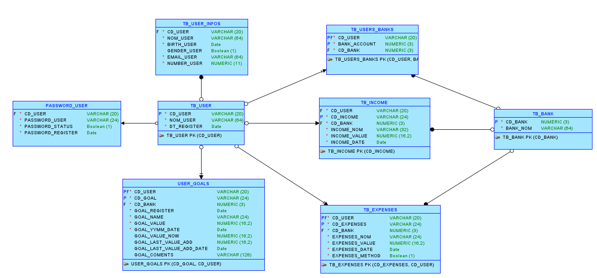
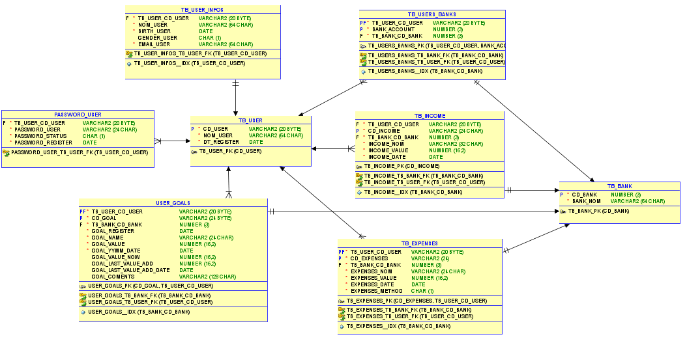

<h1 align="center" style="font-weight: bold;">💻 Fintech</h1>

<p align="center">
 <a href="#about">Sobre</a> •
 <a href="#structure">Estrutura do Projeto</a> •
 <a href="#started">Começando</a> •
</p>

<p align="center"> 
 <b>Uma plataforma financeira para auxiliar na a organizar gastos e despesas! Um projeto do primeiro ano de faculdade.</b>
</p>

<p align="center">
 <a href="">📱 Visite este projeto</a>
</p>


<h2>🎨 Layout</h2>

<p align="center">
 
 
</p>


<h2 id="about">Sobre</h2>

> O FINTECH é um projeto desenvolvido durante o primeiro ano do curso de Análise e Desenvolvimento de Sistemas (ADS) na FIAP.
> O objetivo deste projeto é criar um aplicativo financeiro que auxilie os usuários a administrar suas finanças pessoais de forma prática e eficiente.
> Este repositório será utilizado para documentar todo o processo de desenvolvimento do projeto, que ao longo do ano foi dividido em 7 fases, conforme o material didático da faculdade.
> As atividades estão organizadas em pastas correspondentes a cada uma das fases do desenvolvimento.


<h2 id="structure">📂 Estrutura do Projeto</h2>

```bash
📦 Fintech - (Fiap - Money Minds)
├── 📁 Code
│   ├── 📁 Style
│   ├── 📁 Js
│   ├── 📁 Pages
├── 📁 Documentação
│   ├── 📁 Fase-1
│   │   ├── 📄 StoryMapping.png
│   │   └── 📄 VisãoDoSistema.pdf
│   ├── 📁 Fase-2 
│   │   └── 📄 PrototipoDasTelas.pdf
│   ├── 📁 Fase-3
│   │   ├── 📄 ModeloLogico.png
│   │   ├── 📄 ModeloRelacional.png
│   │   └── 📁 BD-MOneyMind (Modelo logico e ralacional)
│   ├── 📁 Fase-4
│   ├── 📁 Fase-5
│   ├── 📁 Fase-6
│   ├── 📁 Fase-7
│   ├── 📁 IMG (Imagens para a documentação)
├── 📄 index.html (HTML - Money Minds)
├── 📄 README.md
└── 📄 LICENSE
```


<h2 id="started">🚀 Começando</h2>

### Fase 1 - Development Environment 🖥️⚙️

[Documento Visão do Sistema](Documentação/Fase-1/DocumentoVisãoDoSistema.pdf)
[User Story Mapping](Documentação/Fase-1/UserStoryMapping-Money%20Minds.pdf)


### Fase 2 - Prototyping 🧩✏️

> A seguir, é apresentado o protótipo que ilustra a ideia e a visão inicial do projeto, com algumas telas de exemplo mostradas em sequência.
[Protipo das telas](Documentação/Fase-2/MoneyMind-Merged.pdf)


### Fase 3 - Modeling 🧠📊

> O modelo lógico e o modelo relacional do banco de dados do projeto foram desenvolvidos utilizando a ferramenta Oracle SQL Developer Data Modeler, conforme orientação da faculdade.
> *Observação*: um backup completo do banco de dados desenvolvido foi armazenado na pasta: `Fintech-FIAP > Documentação > Fase-3 > BD-MoneyMind`
[📂 Backup Do Projeto](Documentação/Fase-3/BD-MoneyMind/)

<p align="center"> 
  
  
</p>


### Fase 4 - View 🎨👁️

### Fase 5 - OOP 💻🔄

### Fase 6 - Model 🗂️🧱

### Fase 7 - Integration 🔗🚀


## 📜 Licença

Este projeto está sob a licença [MIT]() License.